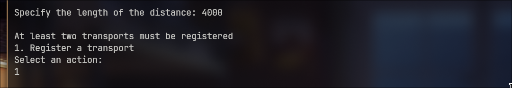
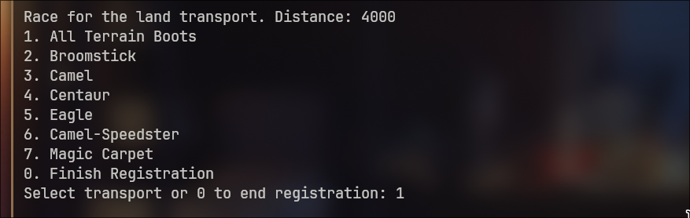
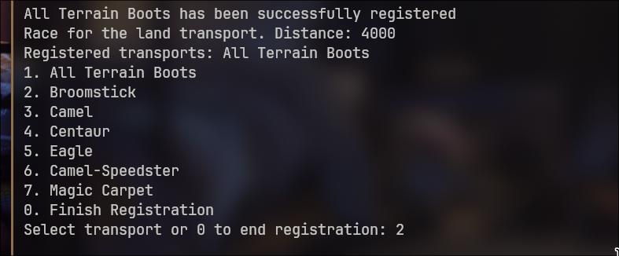
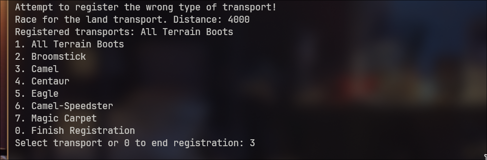
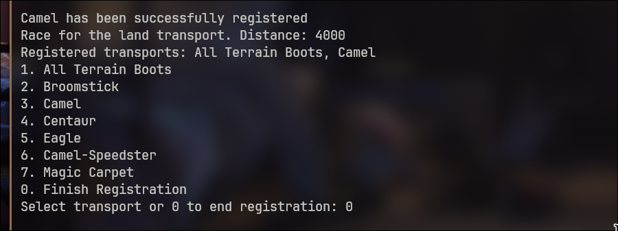
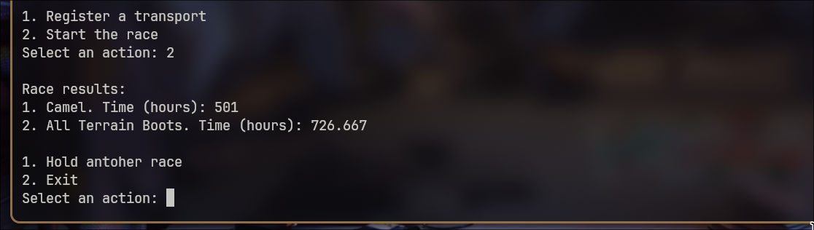

## Race Simulator
### Правила игры
Все ТС делятся на два типа:
- Наземные
- Воздушные

В симуляторе есть множество ТС обоих видов
У каждого задана начальая скорость

#### Наземные ТС
Наземные ТС не могут двигаться непрерывно: после определённого времени им нужно отдыхать. У каждого вида наземного ТС время движения своё. Время отдыха у каждого наземного ТС также различается и зависит от того, какая по счёту эта остановка.

#### Воздушные ТС
Воздушные ТС двигаются непрерывно. Так как они могут облетать препятствия, каждое воздушное ТС имеет собственный коэффициент сокращения расстояния: то есть для каждого воздушного ТС дистанция, которую нужно пройти, уменьшается. Коэффициент сокращения расстояния может зависеть от дистанции.

### Пример работы программы

